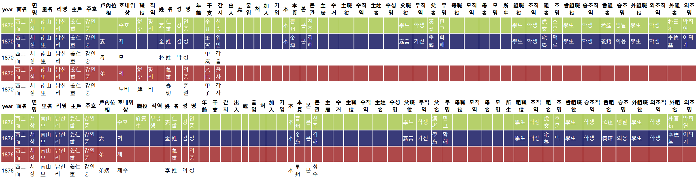

# **snowyseoul**

## A small package for ChosunPop
+ **인구사 연구를 위한 간편한 메소드들 Small methods for historic demography data** <br/>
+ 띄어쓰기 없는 역사자료 텍스트의 편리한 분해를 위한 패키지 (slice_by_idx, slice_by_str) (will be removed) <br/>
+ 한자로 표기된 숫자의 아라비안 십진법 전환 (Chi2Fig) <br/>
+ 간지(干支) 산출을 위한 메소드 (ganji, ganji_gap, years_of_ganji) <br/>

+ (NEW) 동일인 조회를 위한 메소드 (restricted) <br/>

<br/>

## Get snowyseoul
> pip install git+https://github.com/acheul/snowyseoul.git  
> from chosun_pop import *

<br/>

## Exampes

### Chi2Fig  
  
* 한문으로 표기된 숫자를 아라비안 십진법 표기로 전환

```python
Chi2Fig('三百二十一')
```
    >> 321
```python
# 이체자도 가능하다.
Chi2Fig('壹肆百參拾貳')
```
    >> 432

### ganji, ganji_gap, years_of_ganji

```python
# ganji

print(ganji(2021))
print(ganji(2021, kr=True))
```

    >> 辛丑
    >> 신축
    


```python
# 기원전도 가능하다.

print(ganji(-200))
```

    >> 辛丑
    


```python
# ganji_gap

print(ganji_gap("을축", "갑자"))
```

    >> year_gap:  1 or 61 ...
    >> Korean_age:  2 or 62 ...
    >> None
    


```python
# years_of_ganji # ganji의 역기능. # 일단 16~21세기 내에서 추출.

years_of_ganji("신축")
```


    >> [1541, 1601, 1661, 1721, 1781, 1841, 1901, 1961, 2021, 2081]


### (NEW) Display Identical Personnels from the data (restricted usage)
+ 예시  



## About the name
* Why snowyseoul?